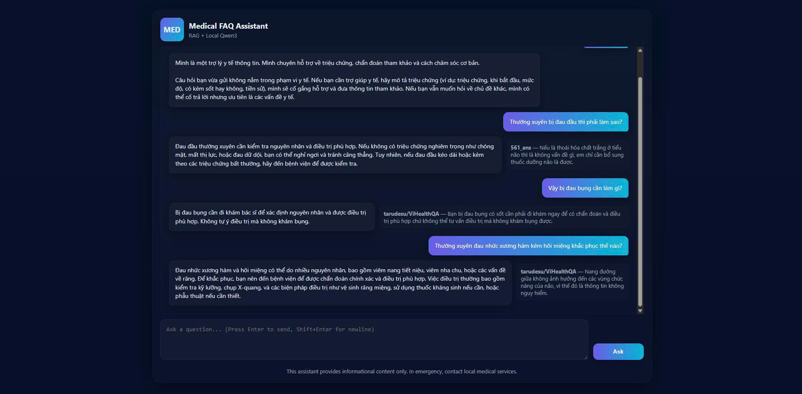

# Medical FAQ Assistant
Automatically generates grounded medical answers by integrating a local Qwen3-1.7B model with a Retrieval-Augmented Generation (RAG) pipeline using LangChain.


## Table of Contents

- [Installation](#installation)
- [Usage](#usage)
- [Demo](#demo)
- [License](#license)

## Installation

1. Clone the repository

```bash
git clone https://github.com/HieuNguyen2910/Medical-FAQ-Assistant
cd Medical-FAQ-Assistant
```

2. Create and activate Conda environment

```bash
conda create -n your_env python=3.10 -y
conda activate your_env
```

3. Install required dependencies
```bash
pip install -r requirements.txt
```

## Usage

```bash
python app.py
```

Access the Web Application: 
open your browser and go to 
*(localhost:8000)*

## Demo

Below is an example.



